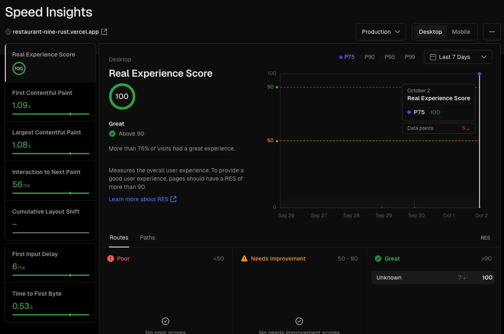

# QikServe challenge - Leandro Simões

I want to express my sincere gratitude for the opportunity to participate in the developer assessment. It has been a valuable experience for me to showcase my skills and knowledge in this area. I appreciate the chance to demonstrate my abilities. Thank you once again for your consideration. I look forward to the possibility of working together.


## Project Overview

In this project, I utilized several powerful technologies to create a dynamic and responsive application.

	•	React: I built the user interface using React, which allowed for the development of reusable components and efficient rendering of the UI.

	•	Styled-Components: To enhance the styling of the application, I implemented Styled-Components. This approach allowed for writing actual CSS code to style components, making it easier to maintain and scale the design.

	•	i18n: For internationalization, I integrated i18n, enabling the application to support multiple languages and providing a seamless experience for users around the globe.

	•	Axios: For making HTTP requests, I used Axios. This library simplified the process of fetching and sending data to external APIs, ensuring efficient communication between the client and server.

	•	Redux: To manage the application state, I implemented Redux. This allowed for a centralized store that maintains the state of the application, making it easier to track changes and manage complex state interactions.
    
	•	Vercel Speed Insights: To optimize performance, I employed Vercel’s tool for Speed Insights. This provided valuable insights into the application’s loading speed and overall performance, allowing for targeted improvements.


## Project Performance




## Getting Started

Install dependencies:

```bash
  yarn
```

Development mode:

```bash
  yarn dev
```
